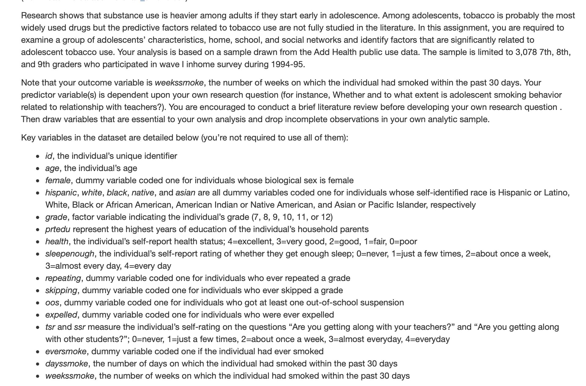
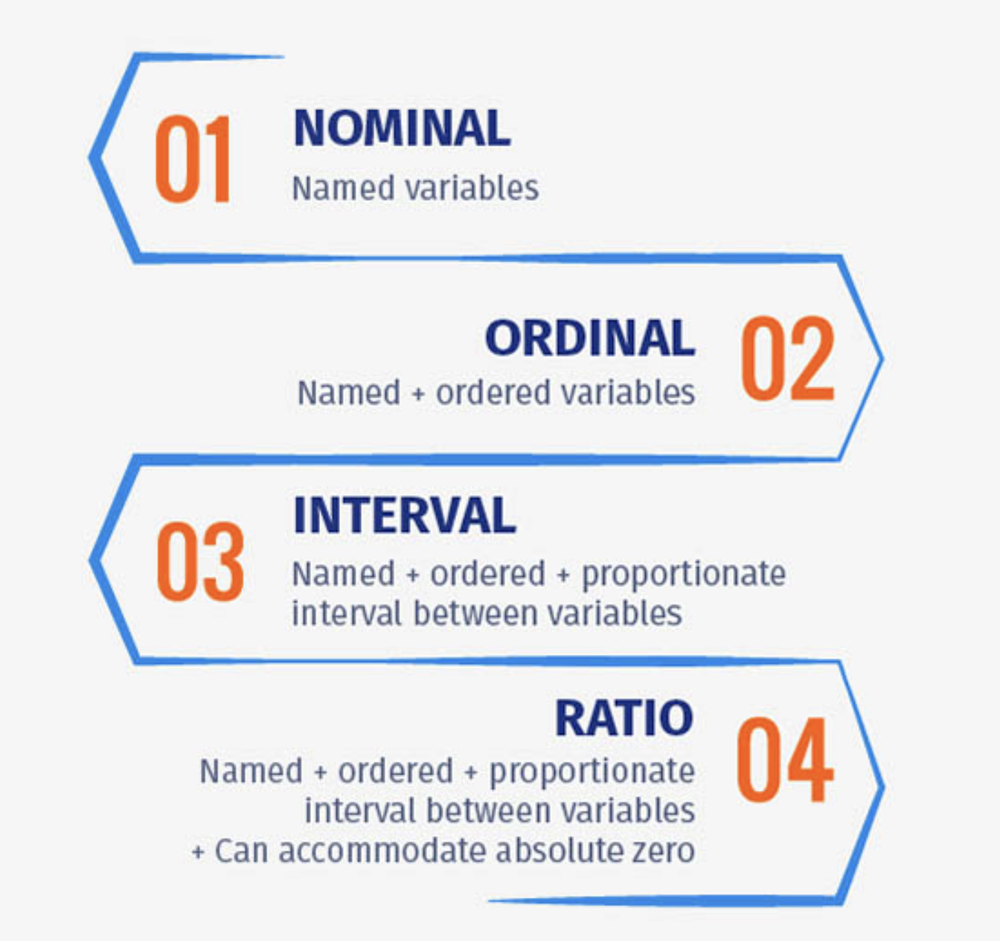

```{r setup, include=FALSE}
options(htmltools.dir.version = FALSE)
```

```{r xaringan-themer, include=FALSE, warning=FALSE}
library(xaringanthemer)
style_duo_accent()
```

## Motivations for today's lab

1. You're "R-eady"

2. R can help you understand more about the class content

3. Start your workflow and prepare for assignments

  - You'll be submitting two files for each assignment, one of the file is "The .Rmd or .R file that you used to render the tables and figures"
  - Here you have tons of questions: what is .Rmd or .R file? what do you mean by "render"? how do you produce tables and figures in R?...
      - while we'll save most of this to future weeks, today you'll learn the first two steps
     
---
## What is an R project?

Simply put, an R project is a collection of documents, workspace, history that

  - has it's own directory on your computer
  
  - and can be loaded to RStudio by opening the file with the ".Proj" extension
  
**(Demo on my computer)**

---
## Why using R projects?

At least three reasons based on previous definition

  - your files will be nicely organized
  
  - it functions as a file folder where you can access/modify locally 
  
  - once it's loaded to your RStudio, you have a working directory:
    - save you a lot of trouble to tell R where to find your datasets/files
    - your products will be saved safe and sound in the folder rather than lost in your file ocean
    - your working history will be saved in the background and restored when you restart RStudio 
    - ...

---
## Today's workflow - create a project

1. Create a new R project in a new directory (do it with me; memorize its name and directory on your computer) 
2. Add a few folders to your project root folder (do it with me; at least two ways)
  - "code", "data", "figure", "table"
  - you can name "data" folder as "Data" but just know that R will treat them as the same directory
3. Add a dataset to your "data" folder
  - Go to my slides page (https://claireconglizhang.github.io/my-slides/) and download the "ah_smoke.csv" dataset and codebook (also I'll show you in the last slide) 
  - put the dataset in your "data" folder
4. Quit your RStudio, go to your project root folder, and open the file with the ".Proj" extension
  - check if your RStudio is automatically loaded
  - check if the project name is displayed correctly on top of the window
  
---
## Today's workflow - create an R script and load in data

1. Within the project, create an R script: a file with the .R extension (do it with me)
  - save it to your project root folder

2. (At least) Two ways to read dataset into your R script:
  - Navigate to RStudio top bar, "File" -> "Import Dataset" -> From Text (base) -> ah_smoke.csv
     - note here for csv dataset, you only need base R
     - but know that different types of dataset require different packages
  - Alternatively, run the following two code lines and see what happened
     - smoke <- read.csv(file = './data/ah_smoke.csv')
     - smoke
---
## Today's add-on

Talk with you neighbor:
  - How many rows and columns in this dataset? 
     - Rstudio give rows and columns "new" names, what are they?
  
  - Go through the variables and find one variable on each of the below scales:
     - Nominal scale
     - Ordinal scale
     - Interval scale
     - Ratio scale

**Thank you for coming! Feel free to leave if finished.**

---
ah_smoke codebook:


---
Recall the four measurement scales (if you evaluate a single variable, swap **"variables"** with **"values"** in the pic down below):



Source: https://www.questionpro.com/blog/nominal-ordinal-interval-ratio/


