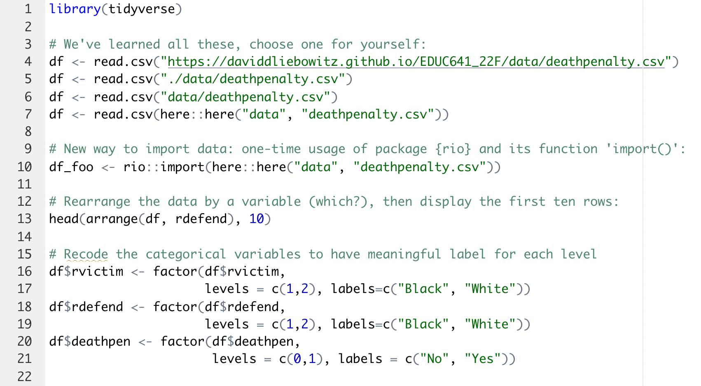
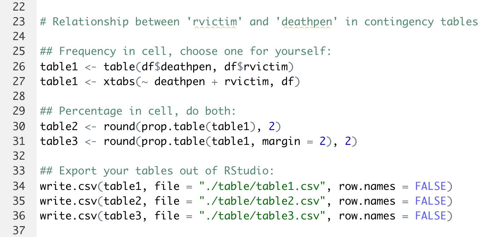
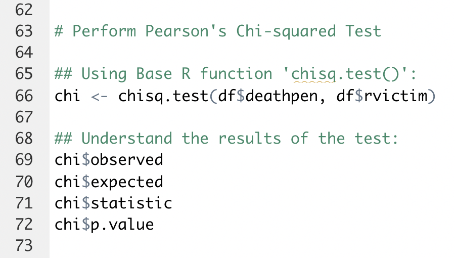

```{r setup, include=FALSE}
options(htmltools.dir.version = FALSE)
```

```{r xaringan-themer, include=FALSE, warning=FALSE}
library(xaringanthemer)
library(countdown)
style_duo_accent()
```

### Today's objectives

1. Check your learning from Unit 2:

  - describe the relationship between two categorical variables by
     - two-way contingency table with frequency or percentage in cell
     - grouped bar chart 
     
  - perform Chi-squared test of categorical association in R
  
2. Prepare for assignment 2:

   - Subsetting data using package {dplyr} function 'filter()'
   - Note that {dplyr} is built in {tidyverse} so you don't need to load it separately

---
### Before lab activities

You should have downloaded Unit 2 lecture code and run it on your own (courseweb -> schedule -> unit2 -> lectures -> R code). If not, do it AFTER the lab.

The last 20 minutes of the lab will be used for 

  - Q&A about assignment 2 (you'll highly likely have zero questions if you follow through the lab activities!)
  - your own time working on assignment 2

**Ready? Time to show our time-management skills!**

---
#### Lab activity 1: set up your working environment in R
First repeat what we've been doing over the past three weeks: create R project, four folders, R script. Then write and run the code below:



`r countdown(minutes = 5, seconds = 0, left = 0, right = 0, padding = "5px", margin = "2%", font_size = "3em")`
---
#### Lab activity 2: categorical relationship in contingency table



`r countdown(minutes = 2, seconds = 0, left = 0, right = 0, padding = "5px", margin = "2%", font_size = "3em")`
---
#### Lab activity 3: categorical relationship in grouped bar chart


`r countdown(minutes = 5, seconds = 0, left = 0, right = 0, padding = "5px", margin = "2%", font_size = "3em")`

---
#### Lab activity 4: Pearson's Chi-squared Test using Base R function 'chisq.test()'

Share with your table what you've learned from the results



`r countdown(minutes = 2, seconds = 0, left = 0, right = 0, padding = "5px", margin = "2%", font_size = "3em")`

---
#### Lab activity 5: subsetting data using package {dplyr} function 'filter()'

Create two sub-samples to separate black defendants from white defendants. Compare df2 and df3 and share with your table
 


`r countdown(minutes = 2, seconds = 0, left = 0, right = 0, padding = "5px", margin = "2%", font_size = "3em")`

---
#### Lab activity 6: re-investigate the 'rvictim' and 'deathpen' relationship when defendant is black


`r countdown(minutes = 2, seconds = 0, left = 0, right = 0, padding = "5px", margin = "2%", font_size = "3em")`

---
### Logistics

Claire has email today's code to the class.

Feel free to leave or stay for your assignment/questions.
