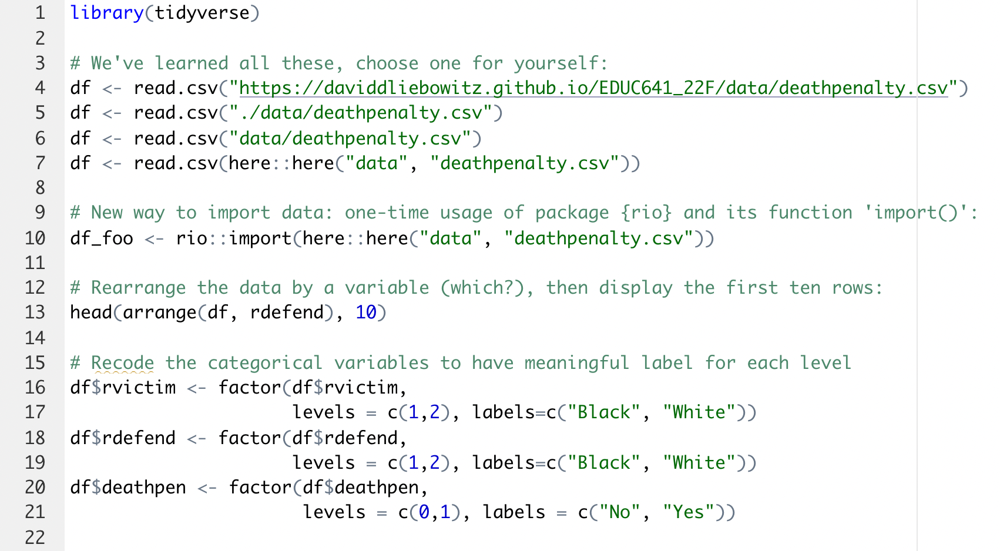
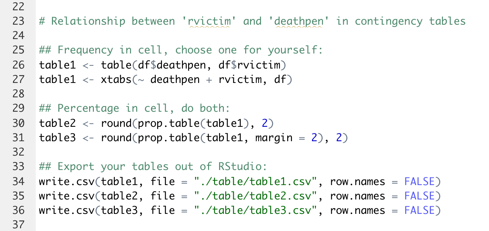
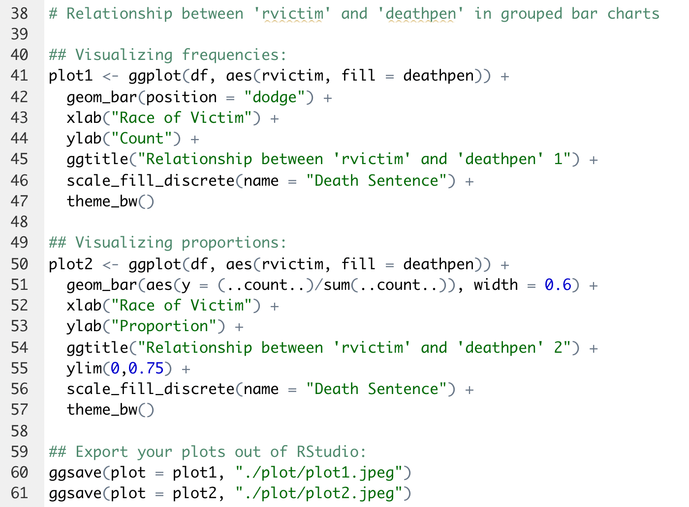
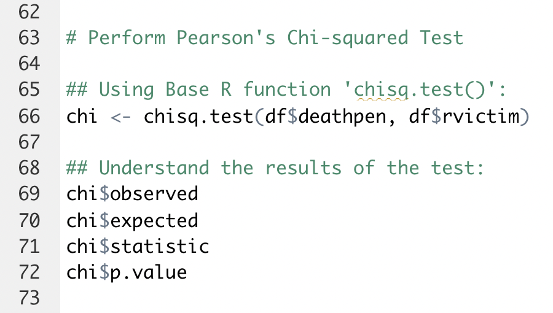
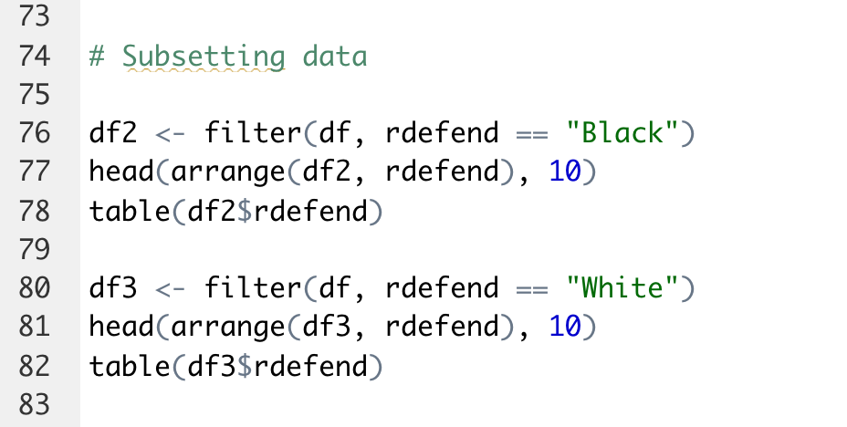
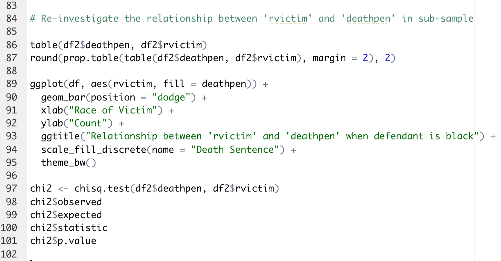

```{r setup, include=FALSE}
options(htmltools.dir.version = FALSE)
```

```{r xaringan-themer, include=FALSE, warning=FALSE}
library(xaringanthemer)
style_duo_accent()
```

### Today's objectives

1. Check your learning from Unit 4:

  - 
     - 
     -  
  
2. R skill for assignment 4:

  - scatterplots and geom_point() 

---
### Before lab activities

1. Find today's code in your mailbox and download it NOW if you haven't done so because:

  - **the code was developed based on a similar structure with assignment 2** (but analyzing deathpenalty.csv rather than cat.csv)
  - **your goal today is running these code to see the results rather than "live coding"** because the group time will be limited to **30 minutes**

2. The last **20 minutes** of the lab will be used for: 

  - Q&A about assignment 2 (you'll highly likely have zero questions if you follow through the lab activities!)
  - your own time working on assignment 2

3. You should have downloaded Unit 2 lecture code (courseweb -> schedule -> unit2 -> lectures -> R code). If not, do it AFTER the lab

---
#### Lab activity 1: set up your working environment in R
First repeat what we've been doing over the past three weeks: create R project, four folders, R script. Then run the code below in your R script:



---
#### Lab activity 2: categorical relationship in contingency table



---
#### Lab activity 3: categorical relationship in grouped bar chart



---
#### Lab activity 4: Pearson's Chi-squared Test using Base R function 'chisq.test()'

Share with your table what you've learned from the results



---
#### Lab activity 5: subsetting data using package {dplyr} function 'filter()'

Create two sub-samples to separate black defendants from white defendants. Compare df2 and df3 and share with your table
 


---
#### Lab activity 6: re-investigate the 'rvictim' and 'deathpen' relationship when defendant is black




**Feel free to leave or stay for your assignment/questions!**
