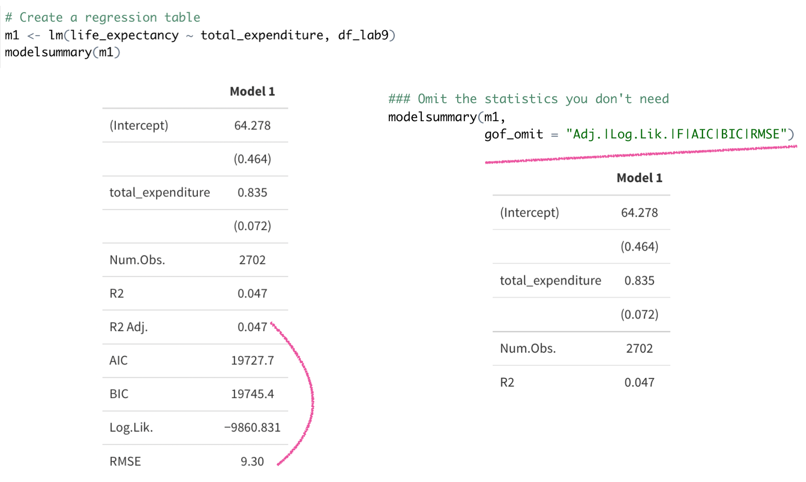

```{r setup, include=FALSE}
options(htmltools.dir.version = FALSE)
```

```{r xaringan-themer, include=FALSE, warning=FALSE}
library(xaringanthemer)
style_duo_accent()
```

```{css, echo=FALSE}
.link-style1 a {
  color: darkviolet;
  text-decoration: underline;
}

.link-style2 a {
 color: seagreen;
 text-decoration: underline;
}

```


### Today's objectives

1. A powerful package, .link-style1[[{modelsummary}](https://vincentarelbundock.github.io/modelsummary/index.html)], to help you produce two types of tables:

  - Summary statistics tables using function: .link-style2[[datasummary_skim()](https://vincentarelbundock.github.io/modelsummary/articles/datasummary.html)]
  
  - Regression tables using function: .link-style2[[modelsummary()](https://vincentarelbundock.github.io/modelsummary/articles/modelsummary.html)]

2. Your own work time on Assignment 4 

  - All code needed for this assignment is covered in .link-style2[[lab8.R](./code/lab8.R)] and .link-style2[[lab9.R](./code/lab9.R)] 
  
  - Make sure to review lecture slides .link-style1[[14](https://daviddliebowitz.github.io/EDUC641_22F/slides/EDUC641_15_regression.html#1)] and .link-style1[[15](https://daviddliebowitz.github.io/EDUC641_22F/slides/EDUC641_16_residuals.html#1)] while forging your answers 
  
  - Q & A for your TAs
  
---

### Same guiding question from last week: what is the relationship between life expectancy and government expenditure on health?

---
### Goal 1. datasummary_skim(): quick overview of numeric or categorical variables
  - If you haven't done so: install.packages("modelsummary") 
  - Set up your RStudio environment as following


---
Note that directly using datasummary_skim() didn't work well:


---
#### Because datasummary_skim() summarizes continuous and categorical variables differently (as it should) AND it doesn't allow users to summarize two types together in a single table
  - So first thing first, always do this before using this function: select key variables (for our case today, three variables: **status**, **total_expenditure**, and **life_expectancy**), check their types, and recode them as needed
     - Note that the variable **status** didn't show up in the previous slide, because it is coded as a character variable but the default argument is datasummary_skim(type = "continuous") 
  


---
### Goal 2. modelsummary(): regression tables with side-by-side models



---


---
### Appendix
Does the relationship between expectancy and expenditure differ for developed vs developing countries? You don't need these code for assignment 4 but for your curiosity as a researcher:

---
 

---


