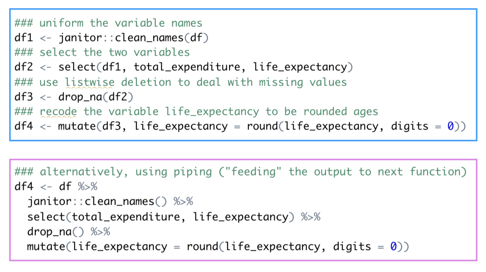
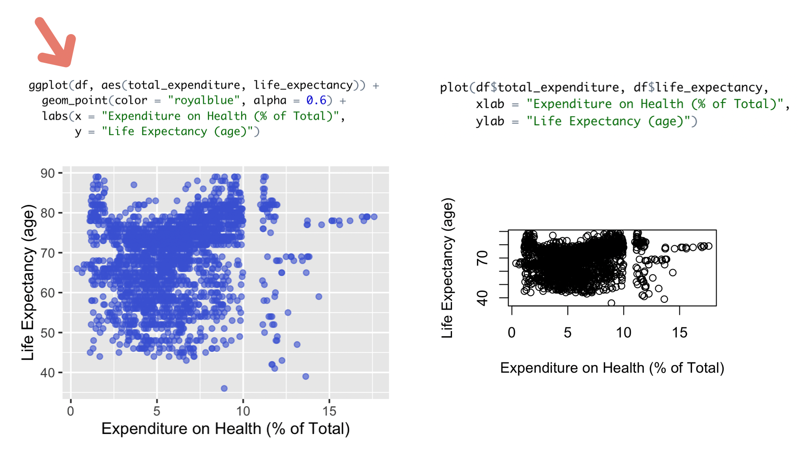
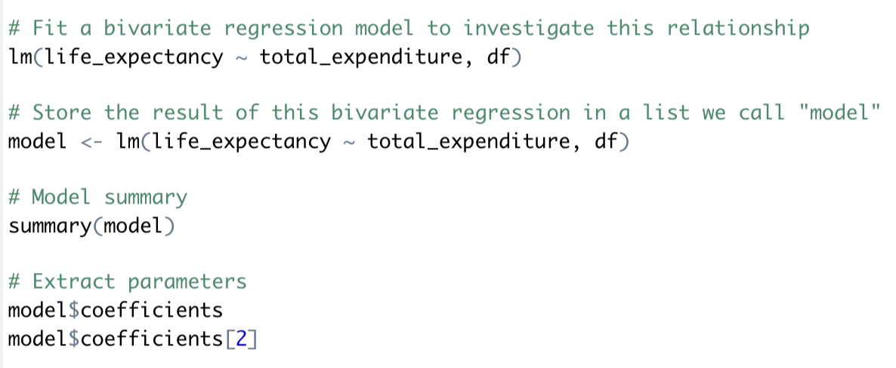

```{r setup, include=FALSE}
options(htmltools.dir.version = FALSE)
```

```{r xaringan-themer, include=FALSE, warning=FALSE}
library(xaringanthemer)
style_duo_accent()
```

### Today's objectives

1. A powerful package, {datasummary}, to help you produce two tables
  - summary statistics table using function: **datasummary_skim()**
  - model report table using function: **modelsummary()**

2. More in supporting your assignment 4
  - A case study 


---
### Clarification before start: Piping
Piping is not required throughout this course but will likely be for EDUC 643. So, why piping, and how? Below two ways of coding are equivalent. Which do you prefer if you can do both? 


---
### Prepare your dataset
Here is one example of your workflow: -- load packages -- read in dataset -- inspect the data -- manage the data (select variables, deal with missing values, recode variables, etc.) -- summarize key variables


---
### Scatterplots (two ways)
Still providing support for {base} users but let's move toward using {ggplot2} because of at least three things we love about it: more intuitive **language**, more **arguments** you can manipulate, and more **layers** to add on to your plots.


---
### Best fit lines (two ways)
Make sure to set y axis to the correct range to avoid missleading images


---
### Perform bivariate regression in R



---
### Working time

  - Retrieve the code file from your mailbox
  - Run the code and see if you have any issues/questions
  - Discuss your findings with your neighbors 
  - Q & A for your TAs
