```{r setup, include=FALSE}
options(htmltools.dir.version = FALSE)
```

```{r xaringan-themer, include=FALSE, warning=FALSE}
library(xaringanthemer)
style_mono_light(base_color = "#23395b",
                 base_font_size = "20px",
                 header_h1_font_size = "2.10rem",
                 header_h2_font_size = "1.10rem")
```

# Research Significance

#### Extended attachment theory

 - Extended Attachment Theory (Birch & Ladd, 1997; Pianta, 1999) posits teachers as potential attachment figures to students at school (Rhodes et al., 2006)

 - Researchers theorize that if a similar positive emotional bonding is established between teachers and students, students will build confidence and motivations, become more engaged in learning activities, and actively develop academic skills (Birch & Ladd, 1997; Roorda et al., 2011; Pianta et al, 2012)

#### Previous research

 - Significant associations between teacher-student relationship and student social and cognitive development (e.g., Cornelius-White, 2007; Davis, 2003; Quin, 2017; Roorda et al., 2011) 

---
# Research Significance (cont'd)

#### Threats to causal inference

 - Omitted variables
   - Ex. highly motivated students may seek for positive relationship with teachers AND perform better than peers
 - Reverse causality
   - the observed associations between TSRs and student outcomes are bidirectional

#### We are interested in the causal impact of TSRs on student outcomes

 - We estimate a large, nationally representative data from China
 - We implement a quasi-experimental design 
   - where we leverage random teacher-student assignment as our source of exogeneity

---
# Research Questions 

1. What teacher characteristics are significantly correlated with affective teacher-student relationship (ATSR)?
 - Our data has measures of whether or not a student likes her teacher therefore allows us to focus on the affective aspect of TSR

2. What are the correlations between ATSR and student academic and non-academic outcomes?
 - We investigate five student outcomes including academic performance, academic confidence, school engagement, interruptive behavior, and mental health issue

3. Whether and to what extent ATSR impacts student outcomes?

---
# Research Design

 - We begin with identifying a set of teacher characteristics that are significant predictive factors of ATSR. 

 - Then examine the associations between ATSR and student outcomes
   - we maximize the estimation precision by accounting for a rich set of covariates from baseline, including student baseline scores and a rich set of student, teacher, homeroom characteristics

 - Most importantly, leveraging the random assignment of teachers and students in the data, we implement an Instrumental Variables Estimation (IVE) approach to identify a source of exogenous variation in ATSR and use only this part to obtain local average treatment effects of ATSR on student outcomes
 
 - Note that in all the models we fit, we control for school fixed-effects and cluster standard errors at school level - an important approach to eliminate systematic differences between schools

---
# Background and school settings

#### Key to our identification strategy: random assignment of teachers to students in China

 - The 2006 Compulsory Education Law banned the sorting of students to teachers based on performance at elementary and middle school level 
 
 - To comply, schools create either random or stratified homerooms of students and teacher groups upon students’ entry to school, then randomly assign a teacher group to each student homeroom
   - students in the same homeroom share a homeroom schedule and teachers rotate to the homeroom to teach
   - to further ensure equal education opportunity, students typically stay in the assigned homerooms and teachers follow them rising to higher grades throughout all years at the same school

---
# Background (cont'd)

#### Our teacher population of interest: the dual-role teacher-advisors

 - School counselor is not a professional job position in China
 
 - School counseling programs are carried by a unique group of teachers: teacher-advisors
   - who are subject teachers (typically core content) who advise one homeroom they teach
   - they take on multiple duties including homeroom management, advisory period, and student counseling
   - they build stronger connections with students than non-advisor teachers do (Shi & Leuwerke, 2010) 

#### Our population of interest

 - Public middle school students in China and their teacher-advisors    

---
# Data 

We draw a large, nationally representative sample from the publicly available, 2013/14 (baseline) and 2014/15 (follow-up) data of China Education Panel Survey (CEPS). 

 - CEPS randomly surveyed 112 schools from the nation but we restricted our sample schools to 63 public schools that BOTH
   - reported that they randomly assigned teachers to students in the beginning of school year 2013/14
   - eliminated student within-school sorting between two waves
   
Our analytic sample contains 4,493 students and our unit of analysis is student.

Our key variables include the predictor variable ATSR, five outcome variables, and a rich set of student, teacher, and homeroom-level covariates.

 - Sample descriptive statistics are presented in Table 1 (next page).

---
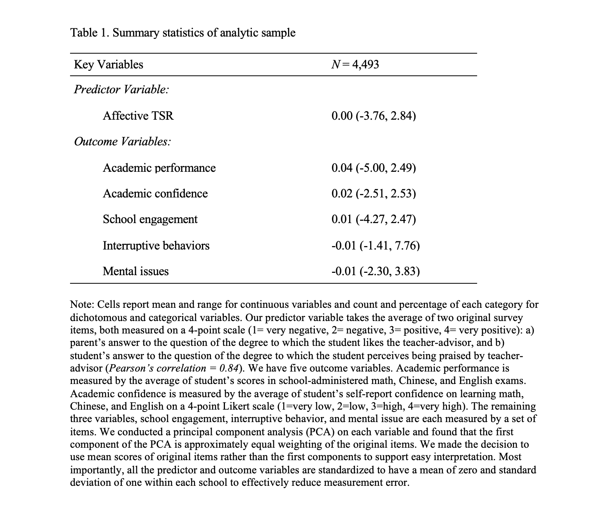

---
# Methods

RQ1: What teacher characteristics are significantly correlated with ATSR?

 - we estimate a linear model by Ordinary Least Squares (OLS) 
   - where we regress the predictor variable (ATSR) separately on each of the teacher characteristics 
   - control for school fixed-effects and cluster standard errors at school level
 
RQ2: What are the correlations between ATSR and student academic/non-academic outcomes?

 - we estimate a linear model by Ordinary Least Squares (OLS) 
   - where we regress each of the five outcome variables separately on ATSR 
   - control for cubic polynomial functions of baseline Chinese, English, math, and CEPS cognitive test scores, as well as student, teacher, and homeroom characteristics
   - control for school fixed-effects and cluster standard errors at school level

---
# Methods (cont'd)

RQ3: Whether and to what extent ATSR impacts student outcomes?

We first identify a valid IV that meets three critical assumptions of IV estimation:

 1. Exogeneity (variation in IV is uncorrelated with the residuals in outcome)
   - here we argue that any teacher characteristics meet this assumption because 
      - they are pre-determined before treatment and randomly assigned to students
      - we also conducted covariates balance check to add evidence to random assignment (following slides)
      
 2. Relevance (IV has impact on predictor variable)
   - during RQ1, we found that among all teacher characteristics, only female teacher dummy variable is significantly correlated with ATSR (following slides)
   
---
# Methods (cont'd)
   
 3. Exclusion restriction (IV ONLY impacts outcomes through predictor)
   - hardest to fully defend in most IV literature
   - a rich, rigorous empirical literature body shows that teacher gender does have causal impact on student outcomes but mainly through teacher-student gender match (e.g., Antecol et al., 2015, Bhattacharya et al., 2022; Gong et al., 2018; Xu & Li, 2018)
   - we will control for student gender fixed-effects (to account for difference in outcomes between male and female students) as robustness check in our analysis
   
We conclude that teacher female is a valid instrumental variable for our study.
   
---
**Evidence of IV relevance** 

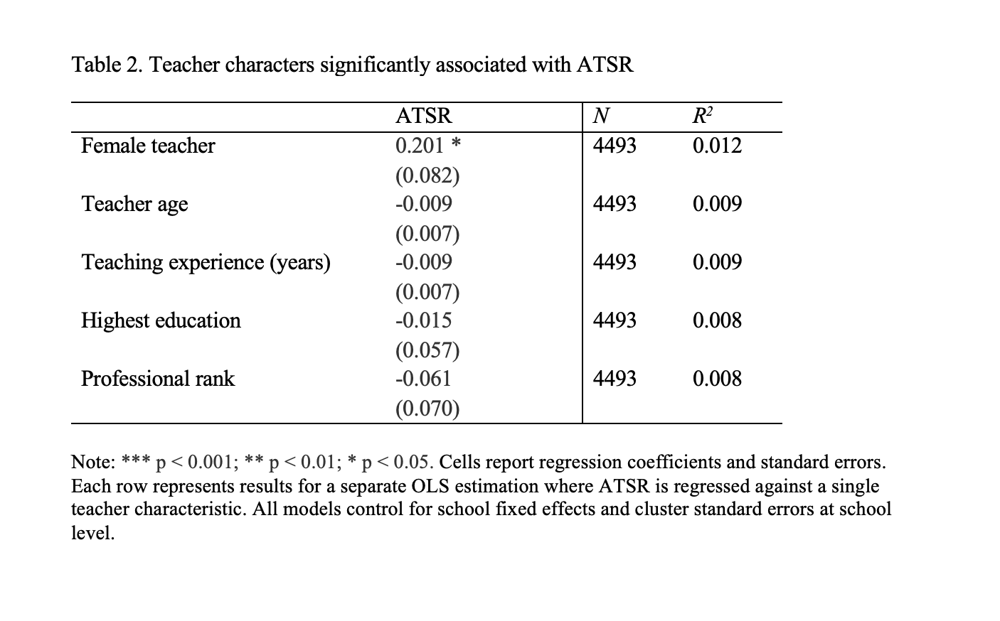

---
**Evidence of IV exogeneity**

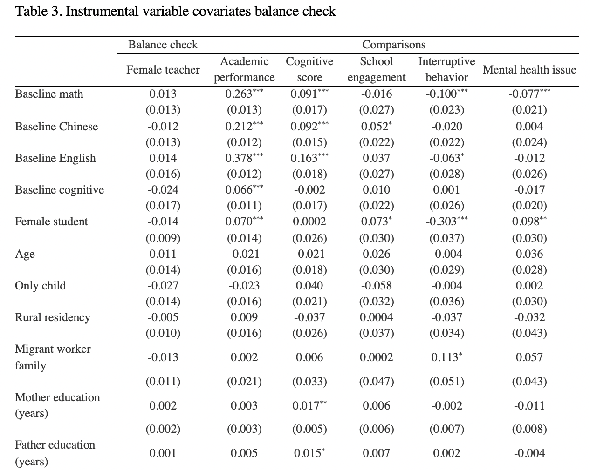
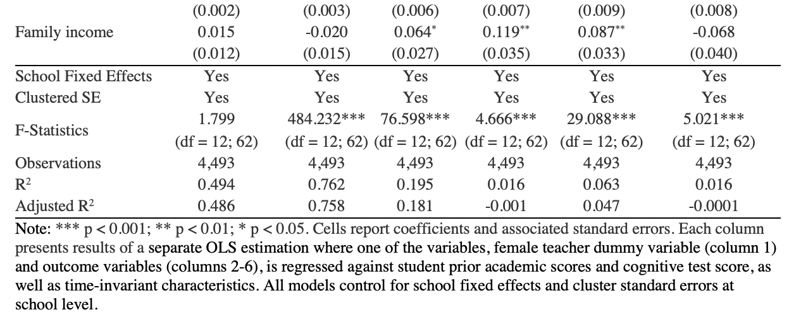

---
# Methods (cont'd)

To answer RQ3, we use teacher female as IV to obtain the local average treatment effects of ATSR on student outcomes in a two-stage least squares approach, where we

 - control for cubic polynomial functions of baseline Chinese, English, math, and CEPS cognitive test scores, as well as student, teacher, and homeroom characteristics
 - and control for school fixed-effects and cluster standard errors at school level
  
Additionally, we conduct a set of robustness check by adding female student fixed-effects to account for the effect of gender match (potential pathway from IV to outcome)

---
# RQ1 Results

**What teacher characteristics are significantly correlated with ATSR?**


---
# RQ2 Results

**What are the correlations between ATSR and student academic and non-academic outcomes?**

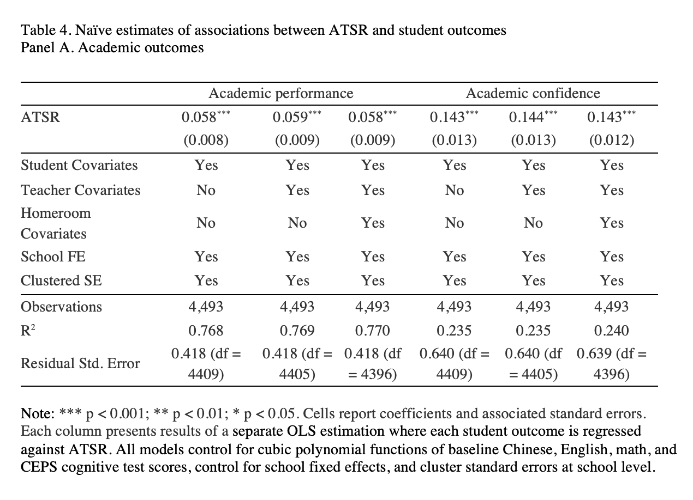

---
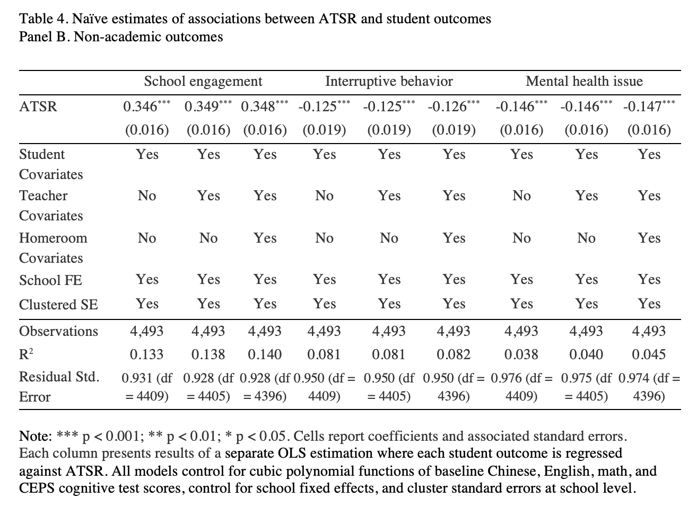

---
# RQ3 Results 

**Whether and to what extent ATSR impacts student outcomes?**

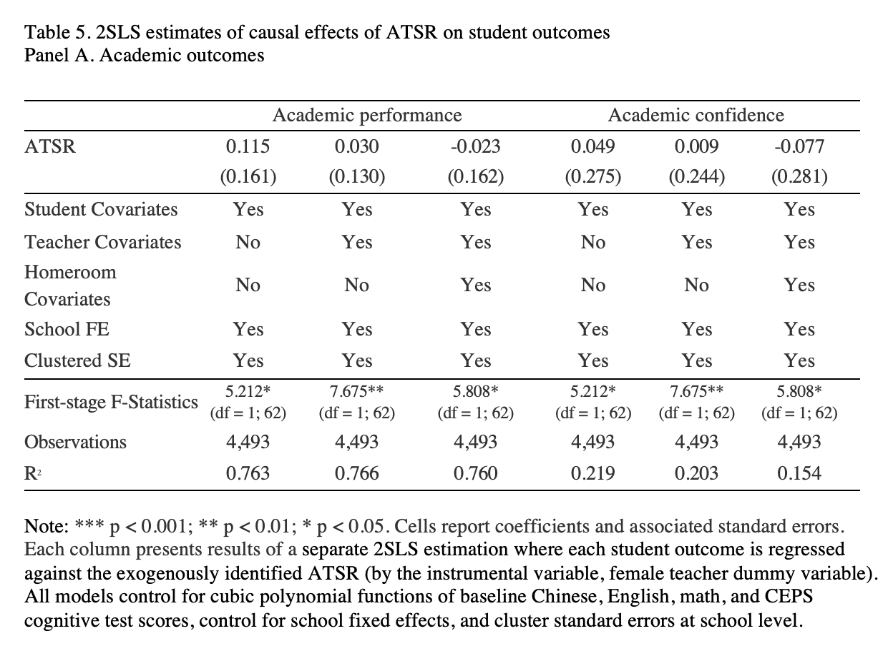

---
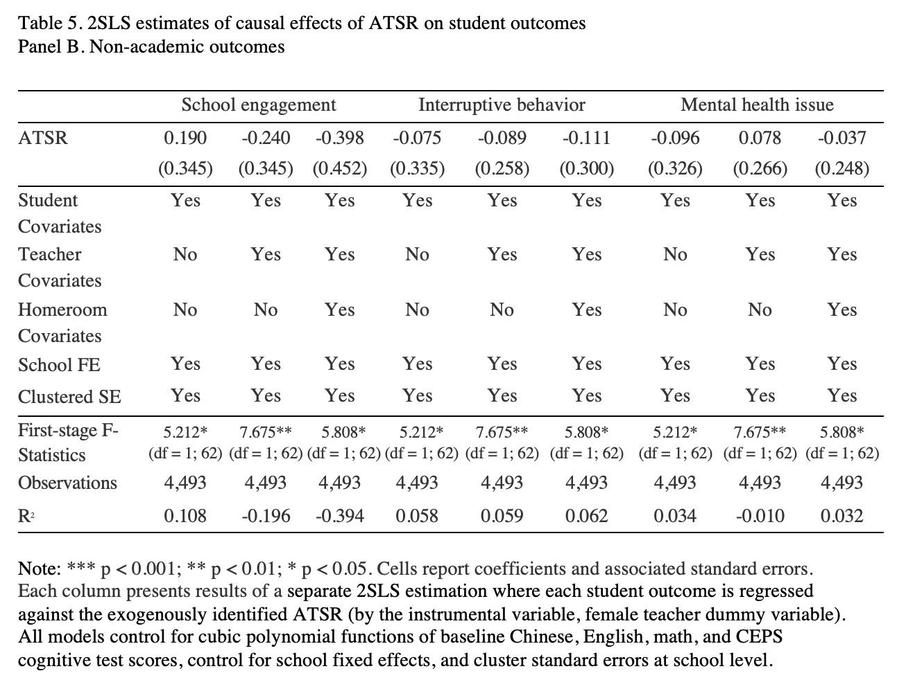


---
# RQ3 Results (cont'd)

Robustness check: additionally, we control for female student fixed-effects:

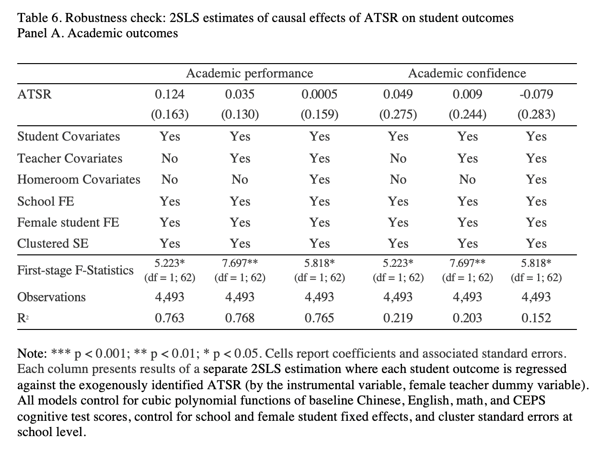

---
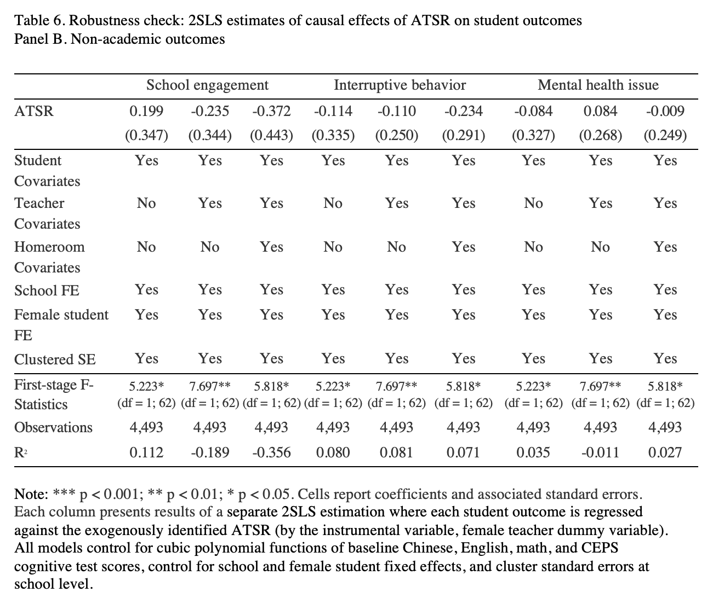

---
# Discussions and Conclusions

#### Our findings

 - Consistent with existing literature, we found positive relationships between ATSR and student academic performance, confidence, and school engagement, and negative relationships between ATSR and interruptive behaviors and mental health issues
 
 - However, the causal impacts of ATSR on any of the five outcomes are not significantly different from zero
 
 - Our findings support the scenario many educators observe: students learn (or not learn) regardless they like their teachers or not
   - and do not support the book title: "Kids don't learn from people they don't like"
   
---
#### Our limitations
In research design
 - The random assignment of teachers to students are based on educational policy and observed covariates balance in the data rather than researcher-implemented randomized controlled trial
 - Our estimates are "localized" around the IV/teacher female and future research using different instrumental variable may have different estimates

In data
 - Limited information on the degree of measurement errors or data missingness (although all below 3%, most below 2%) reasons
 - The measure of ATSR is not ideal (average two items from parent and student surveys)

In generalizability of our findings
 - Our findings are most relevant to Chinese middle schools in which random assignment is strictly implemented
 - Our teacher population is dual-role teacher-advisors rather than traditional classroom teachers

---
References

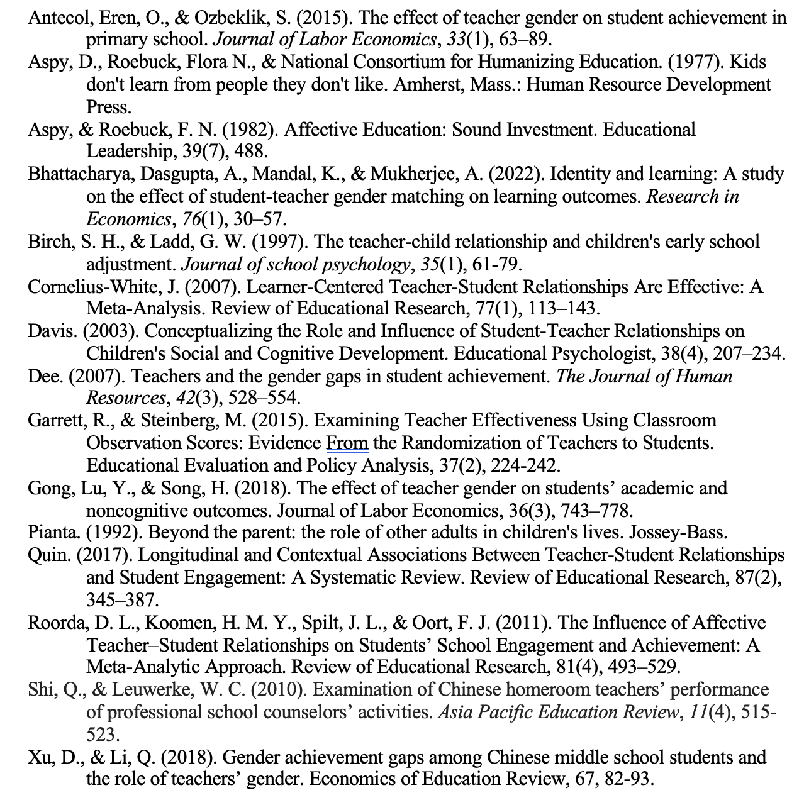
---
class: center, middle

# Thank you for your time! 

Please forward any questions to congliclairezhang@gmail.com

Slides created via the R package [**xaringan**](https://github.com/yihui/xaringan)

