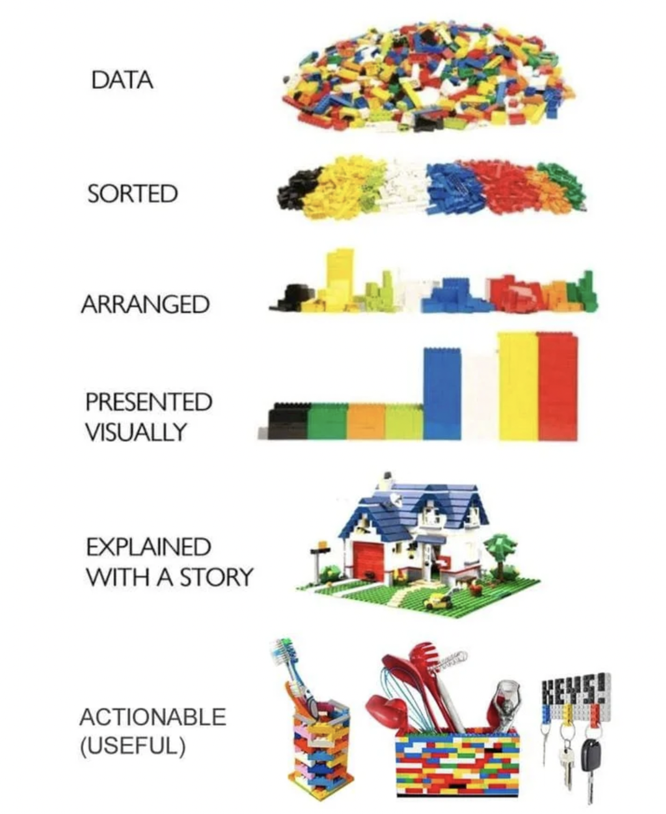

```{r setup, include=FALSE}
options(htmltools.dir.version = FALSE)
xaringanExtra::use_editable(expires = 1)
```

```{r xaringan-themer, include=FALSE, warning=FALSE}
library(xaringanthemer)
style_mono_light(base_color = "#293D4B",
                 base_font_size = "20px",
                 header_h1_font_size = "2.10rem",
                 header_h2_font_size = "1.80rem")
```

## Cityconnect

Interviewers:
Katie Drucker
Mengguo Jing

Researcher, Center for Thriving Children

Background: The Mary E. Walsh Center for Thriving Children (CTC) at Boston College uses research and data to identify and evaluate strategies that successfully transform schools and communities into systems of opportunity for all students. We conduct interdisciplinary research that builds on the strengths of both science and practice to understand what it takes to produce a true opportunity for all.

CTC houses the City Connects intervention, an innovative and evidence-based approach to addressing the out-of-school factors that can impact students’ achievement and thriving in schools.

---

I obtained systematic training in quantitative research methods and educational data science in my doctoral program. 

My research competencies include experimental and quasi-experimental research design, generalized linear models, multilevel models, structural equation modeling, advanced measurement and assessment methods, implementation science, policy analysis, program evaluation, meta-analysis, scholarly writing, and grant writing. 

Beyond my program, I took courses from the Economics department to add causal inference methods to my toolkit. I also finished a sequence of four R courses and obtained a specialization in educational data science.

Importantly, I kept honing my skills by applying my expertise to a variety of research projects. Both independently and in collaboration with my co-authors, I led several research projects and presented my papers in multiple national conferences such as AERA, AEFP, and SREE.

---
I am experienced in managing, visualizing, and modeling large-scale, longitudinal data. 

As an applied researcher passionate about school effectiveness and improvement, my overarching research interest is to unfold the causal impacts of various school-, teacher-, family-level factors on student performance as well as non-academic outcomes in P-12 education. 

My dissertation, for example, consists of three separate articles investigating the causal impacts of teacher human capital characteristics, advisor-advisee relationships, and classroom teacher-student relationships on student performance and attitude. Another ongoing study is focusing on gender gaps and causal evidence on teacher factors that bridge these gaps. 

These studies contribute to a rigorous research body that identify what bring meaningful change to school outcomes, and more importantly, can be directly translated into practice, therefore have critical implications to policymakers, school leaders, and importantly, teachers.

---
class:center, middle
The Lego Data Story



